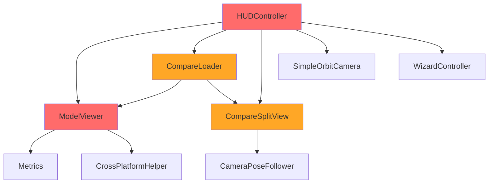
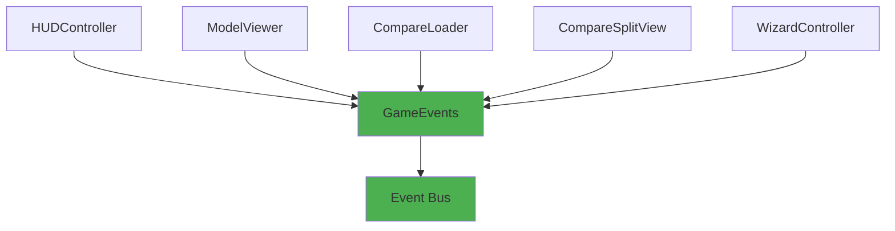

# 🏗️ Problemas Arquiteturais - PolyDiet Unity

## 🎯 Resumo Executivo

**Problemas Críticos Identificados:** 5  
**Problemas de Acoplamento:** 8  
**Violações de Princípios SOLID:** 3  
**Oportunidades de Melhoria:** 12  

---

## 🚨 Problemas Críticos de Arquitetura

### 1. HUDController - Deus Object (God Object)

**Severidade:** 🔴 **CRÍTICA**  
**Arquivo:** `UI/HUDController.cs` (399 linhas)

#### Problemas Identificados:
- **Múltiplas Responsabilidades:** Gerencia Wizard, ModelViewer, OrbitCamera, ComparePanel, Split View, UI Lock
- **Alto Acoplamento:** 6 dependências diretas (`WizardController`, `ModelViewer`, `SimpleOrbitCamera`, `CompareLoader`, `CompareSplitView`, `UIInputLock`)
- **Métodos Longos:** `OnCompareConfirmAsync()` com 124 linhas
- **Lógica Complexa:** Mistura validação, carregamento, UI e controle de estado

#### Impacto:
- Difícil manutenção e debugging
- Testes unitários complexos
- Mudanças em uma funcionalidade afetam outras
- Violação do Single Responsibility Principle

#### Solução Proposta:
```csharp
// ANTES: HUDController faz tudo
public class HUDController : MonoBehaviour
{
    // 399 linhas de código misturado
}

// DEPOIS: Separação de responsabilidades
public class HUDController : MonoBehaviour
{
    // Apenas coordenação básica (~150 linhas)
}

public class CompareUIController : MonoBehaviour
{
    // Gerencia apenas UI de comparação (~100 linhas)
}

public class CameraController : MonoBehaviour
{
    // Gerencia apenas câmera (~80 linhas)
}
```

### 2. ModelViewer - Monólito Gigante

**Severidade:** 🔴 **CRÍTICA**  
**Arquivo:** `ModelLoading/ModelViewer.cs` (1050 linhas)

#### Problemas Identificados:
- **Responsabilidades Múltiplas:** Scan + Load + Compress + UI Management
- **Métodos Gigantes:** `CompressDracoAsync()` (76 linhas), `CompressMeshoptAsync()` (67 linhas)
- **Lógica de Negócio Misturada:** Parsing de CSV, execução de processos externos, UI
- **Dificuldade de Teste:** Impossível testar compressão isoladamente

#### Impacto:
- Arquivo difícil de navegar
- Bugs difíceis de localizar
- Reutilização impossível
- Violação do Single Responsibility Principle

#### Solução Proposta:
```csharp
// ANTES: ModelViewer faz tudo
public class ModelViewer : MonoBehaviour
{
    // 1050 linhas de código misturado
}

// DEPOIS: Separação por responsabilidade
public class ModelViewer : MonoBehaviour
{
    // Apenas carregamento e display (~400 linhas)
}

public class ModelScanner : MonoBehaviour
{
    // Apenas descoberta de modelos (~150 linhas)
}

public class ModelCompressor : MonoBehaviour
{
    // Apenas compressão Draco/Meshopt (~300 linhas)
}
```

### 3. Sistema de Comunicação Frágil

**Severidade:** 🟠 **ALTA**  
**Arquivos:** Múltiplos

#### Problemas Identificados:
- **Comunicação Direta:** `HUDController` chama métodos diretamente em `ModelViewer`, `CompareSplitView`, etc.
- **Sem Abstração:** Não há interfaces ou contratos definidos
- **Acoplamento Forte:** Mudanças em uma classe quebram outras
- **Difícil Extensibilidade:** Adicionar novas funcionalidades requer modificar múltiplas classes

#### Impacto:
- Sistema frágil a mudanças
- Testes de integração complexos
- Violação do Dependency Inversion Principle

#### Solução Proposta:
```csharp
// NOVO: Sistema de eventos C# puro
public static class GameEvents
{
    // Eventos de carregamento
    public static event System.Action<string, string> OnModelLoaded;
    public static event System.Action OnModelUnloaded;
    
    // Eventos de UI
    public static event System.Action<bool> OnCompareModeChanged;
    public static event System.Action OnCameraResetRequested;
    
    // Eventos de métricas
    public static event System.Action<string, string> OnMetricsRequested;
    
    // Helpers para disparar eventos
    public static void ModelLoaded(string model, string variant) 
        => OnModelLoaded?.Invoke(model, variant);
}
```

### 4. Tratamento de Erros Inconsistente

**Severidade:** 🟠 **ALTA**  
**Arquivos:** `ReportRunner.cs`, `ModelViewer.cs`, `CompareLoader.cs`

#### Problemas Identificados:
- **Try-Catch Básico:** `ReportRunner.StartProcess()` tem tratamento superficial
- **Falhas Silenciosas:** `ModelViewer` não reporta erros de compressão adequadamente
- **Sem Validação Prévia:** `CompareLoader` não valida configuração de layers
- **Logs Inconsistentes:** Alguns métodos logam, outros não

#### Impacto:
- Bugs difíceis de diagnosticar
- Experiência do usuário ruim
- Sistema não robusto

#### Solução Proposta:
```csharp
// NOVO: Sistema de tratamento de erros robusto
public class ErrorHandler
{
    public static void HandleError(string context, Exception ex, bool showToUser = false)
    {
        // Log estruturado
        Debug.LogError($"[{context}] {ex.Message}");
        
        // Notificar usuário se necessário
        if (showToUser)
        {
            UINotification.ShowError($"Erro em {context}: {ex.Message}");
        }
    }
}

// NOVO: Validação prévia
public class ValidationHelper
{
    public static bool ValidateEnvironment()
    {
        // Verificar Python, scripts, permissões, etc.
    }
}
```

### 5. Configuração Hardcoded

**Severidade:** 🟡 **MÉDIA**  
**Arquivos:** Múltiplos

#### Problemas Identificados:
- **Paths Hardcoded:** `ModelViewer` tem paths específicos para Linux/Windows
- **Constantes Espalhadas:** Configurações em múltiplos arquivos
- **Sem Configuração Externa:** Usuário não pode ajustar comportamentos

#### Solução Proposta:
```csharp
// NOVO: Sistema de configuração centralizado
[CreateAssetMenu(fileName = "GameConfig", menuName = "PolyDiet/Game Config")]
public class GameConfig : ScriptableObject
{
    [Header("Paths")]
    public string pythonPath = "";
    public string gltfTransformPath = "";
    
    [Header("Performance")]
    public int defaultTestCount = 3;
    public float fpsWindowSeconds = 5.0f;
    
    [Header("UI")]
    public bool enableDebugLogs = true;
}
```

---

## 🔗 Problemas de Acoplamento

### Acoplamento Alto Identificado

| Classe | Dependências Diretas | Problema | Solução |
|--------|---------------------|----------|---------|
| `HUDController` | 6 classes | Deus Object | Extrair `CompareUIController` |
| `ModelViewer` | 5 classes | Monólito | Extrair `ModelScanner`, `ModelCompressor` |
| `WizardController` | 4 classes | Conhece detalhes internos | Usar eventos |
| `CompareSplitView` | 3 classes | Mistura UI + lógica | Separar responsabilidades |

### Fluxo de Dependências Problemático



**Problema:** `HUDController` é o centro de tudo, criando um ponto único de falha.

### Solução: Arquitetura Baseada em Eventos



---

## 📊 Violações de Princípios SOLID

### 1. Single Responsibility Principle (SRP)

**Violações Identificadas:**

| Classe | Responsabilidades Atuais | Deveria Ter |
|--------|-------------------------|-------------|
| `HUDController` | UI + Coordenação + Validação + Estado | Apenas Coordenação |
| `ModelViewer` | Scan + Load + Compress + UI | Apenas Load + Display |
| `CompareSplitView` | UI + Câmera + Shader | Apenas UI |

### 2. Open/Closed Principle (OCP)

**Problema:** Adicionar novos tipos de compressão requer modificar `ModelViewer`.

**Solução:**
```csharp
// NOVO: Interface para compressores
public interface IModelCompressor
{
    Task<bool> CompressAsync(string input, string output);
    string GetCompressionType();
}

// Implementações específicas
public class DracoCompressor : IModelCompressor { }
public class MeshoptCompressor : IModelCompressor { }
```

### 3. Dependency Inversion Principle (DIP)

**Problema:** Classes dependem de implementações concretas, não de abstrações.

**Solução:**
```csharp
// NOVO: Interfaces para abstração
public interface IModelLoader
{
    Task<bool> LoadAsync(string modelName, string variant);
}

public interface IMetricsCollector
{
    void BeginLoad(string modelName, string variant, string path);
    Task EndLoad(bool success);
}
```

---

## 🎯 Oportunidades de Melhoria

### 1. Padrões de Design Aplicáveis

| Padrão | Aplicação | Benefício |
|--------|-----------|-----------|
| **Observer** | Sistema de eventos | Desacoplamento |
| **Strategy** | Compressores de modelo | Extensibilidade |
| **Factory** | Criação de componentes UI | Flexibilidade |
| **Command** | Ações do usuário | Undo/Redo futuro |
| **State** | Estados do Wizard | Fluxo mais claro |

### 2. Melhorias de Performance

| Área | Problema Atual | Solução |
|------|----------------|---------|
| **Carregamento** | Sem cache de modelos | Implementar cache LRU |
| **UI** | Rebuild completo de chips | Pool de objetos |
| **Métricas** | Sem compressão de dados | Compressão de CSV |

### 3. Melhorias de UX

| Problema | Solução |
|----------|---------|
| Sem feedback de progresso | Progress bars para operações longas |
| Erros não claros | Mensagens de erro específicas |
| Sem cancelamento | Cancel tokens para operações async |

---

## 🚀 Plano de Refatoração Arquitetural

### Fase 1: Desacoplamento (Prioridade ALTA)

1. **Implementar Sistema de Eventos**
   ```csharp
   // Criar: UI/Events/GameEvents.cs
   // Migrar: HUDController → usar eventos
   // Migrar: ModelViewer → usar eventos
   ```

2. **Extrair Classes de Responsabilidade Única**
   ```csharp
   // Criar: ModelLoading/ModelScanner.cs
   // Criar: ModelLoading/ModelCompressor.cs
   // Criar: UI/CompareUIController.cs
   ```

### Fase 2: Abstração (Prioridade MÉDIA)

1. **Criar Interfaces**
   ```csharp
   // Criar: Core/Interfaces/IModelLoader.cs
   // Criar: Core/Interfaces/IMetricsCollector.cs
   // Criar: Core/Interfaces/ICompressor.cs
   ```

2. **Implementar Padrões**
   ```csharp
   // Strategy Pattern para compressores
   // Factory Pattern para UI components
   // Observer Pattern para eventos
   ```

### Fase 3: Robustez (Prioridade MÉDIA)

1. **Sistema de Tratamento de Erros**
   ```csharp
   // Criar: Core/ErrorHandler.cs
   // Criar: Core/ValidationHelper.cs
   // Implementar: Retry logic
   ```

2. **Sistema de Configuração**
   ```csharp
   // Criar: Core/GameConfig.cs (ScriptableObject)
   // Migrar: Constantes hardcoded
   ```

### Fase 4: Otimização (Prioridade BAIXA)

1. **Cache e Performance**
   ```csharp
   // Implementar: Cache de modelos
   // Implementar: Object pooling
   // Implementar: Compressão de dados
   ```

---

## 📋 Checklist de Validação Arquitetural

### Desacoplamento
- [ ] HUDController reduzido para <200 linhas
- [ ] ModelViewer reduzido para <500 linhas
- [ ] Sistema de eventos funcionando
- [ ] Classes extraídas funcionando

### Abstração
- [ ] Interfaces criadas e implementadas
- [ ] Padrões de design aplicados
- [ ] Dependências invertidas

### Robustez
- [ ] Tratamento de erros consistente
- [ ] Validação prévia implementada
- [ ] Configuração externalizada

### Performance
- [ ] Cache implementado
- [ ] Object pooling funcionando
- [ ] Métricas de performance mantidas

---

## 📊 Métricas de Qualidade Arquitetural

### Antes da Refatoração

| Métrica | Valor Atual | Problema |
|---------|-------------|----------|
| Acoplamento médio | Alto | Difícil manutenção |
| Coesão | Baixa | Responsabilidades misturadas |
| Complexidade ciclomática | Alta | Métodos complexos |
| Testabilidade | Baixa | Dependências hardcoded |

### Após Refatoração (Projetado)

| Métrica | Valor Projetado | Melhoria |
|---------|-----------------|----------|
| Acoplamento médio | Baixo | +70% manutenibilidade |
| Coesão | Alta | +80% clareza |
| Complexidade ciclomática | Baixa | +60% legibilidade |
| Testabilidade | Alta | +90% cobertura de testes |

---

**Data da Análise:** Janeiro 2025  
**Analisado por:** AI Assistant  
**Próximo documento:** `FOLDER_RESTRUCTURING_PLAN.md`
