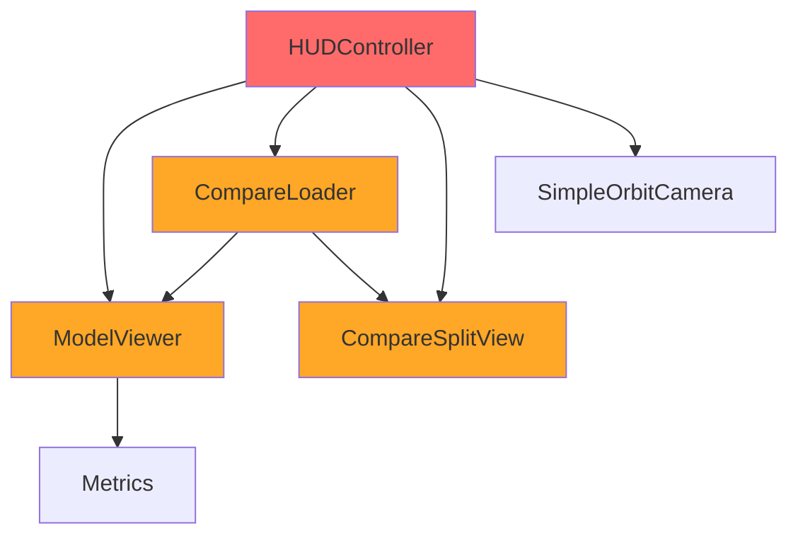
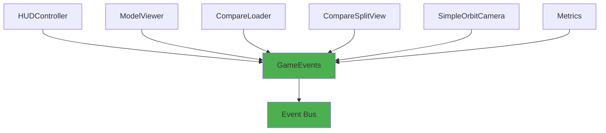

# 🎯 Sistema de Eventos - PolyDiet Unity

## 🎯 Resumo Executivo

**Padrão Escolhido:** Eventos C# puros (System.Action)  
**Arquivos a Criar:** 2 arquivos principais  
**Classes a Migrar:** 4 classes principais  
**Benefícios:** Desacoplamento + Testabilidade + Extensibilidade  

---

## 🏗️ Arquitetura do Sistema de Eventos

### Visão Geral

O sistema de eventos foi projetado para desacoplar componentes que atualmente têm dependências diretas, seguindo o padrão **Observer** com implementação C# pura.

### Fluxo Atual vs Proposto

#### Fluxo Atual (Acoplado)


#### Fluxo Proposto (Desacoplado)


---

## 📁 Estrutura de Arquivos

### Arquivo Principal: `UI/Events/GameEvents.cs`

```csharp
using System;
using UnityEngine;

namespace PolyDiet.UI.Events
{
    /// <summary>
    /// Sistema central de eventos para comunicação entre componentes
    /// Desacopla componentes que anteriormente tinham dependências diretas
    /// </summary>
    public static class GameEvents
    {
        #region Model Events
        
        /// <summary>
        /// Disparado quando um modelo é carregado com sucesso
        /// </summary>
        /// <param name="modelName">Nome do modelo carregado</param>
        /// <param name="variant">Variante do modelo (original, draco, meshopt)</param>
        public static event Action<string, string> OnModelLoaded;
        
        /// <summary>
        /// Disparado quando um modelo é descarregado
        /// </summary>
        public static event Action OnModelUnloaded;
        
        /// <summary>
        /// Disparado quando há erro no carregamento de modelo
        /// </summary>
        /// <param name="modelName">Nome do modelo que falhou</param>
        /// <param name="variant">Variante que falhou</param>
        /// <param name="errorMessage">Mensagem de erro</param>
        public static event Action<string, string, string> OnModelLoadError;
        
        /// <summary>
        /// Disparado quando a lista de modelos disponíveis é atualizada
        /// </summary>
        /// <param name="modelNames">Lista de nomes de modelos disponíveis</param>
        public static event Action<string[]> OnModelsListUpdated;
        
        #endregion
        
        #region UI Events
        
        /// <summary>
        /// Disparado quando o modo de comparação é ativado/desativado
        /// </summary>
        /// <param name="isActive">True se modo compare ativo, false se desativado</param>
        public static event Action<bool> OnCompareModeChanged;
        
        /// <summary>
        /// Disparado quando painel de UI é aberto/fechado
        /// </summary>
        /// <param name="panelName">Nome do painel (ex: "Wizard", "Metrics", "Compare")</param>
        /// <param name="isOpen">True se aberto, false se fechado</param>
        public static event Action<string, bool> OnPanelVisibilityChanged;
        
        /// <summary>
        /// Disparado quando há mudança na seleção de variantes
        /// </summary>
        /// <param name="selectedVariants">Lista de variantes selecionadas</param>
        public static event Action<string[]> OnVariantSelectionChanged;
        
        #endregion
        
        #region Camera Events
        
        /// <summary>
        /// Disparado quando reset da câmera é solicitado
        /// </summary>
        public static event Action OnCameraResetRequested;
        
        /// <summary>
        /// Disparado quando target da câmera é alterado
        /// </summary>
        /// <param name="target">Novo target da câmera</param>
        public static event Action<Transform> OnCameraTargetChanged;
        
        /// <summary>
        /// Disparado quando modo de câmera muda (normal vs compare)
        /// </summary>
        /// <param name="mode">Modo da câmera ("Normal", "Compare")</param>
        public static event Action<string> OnCameraModeChanged;
        
        #endregion
        
        #region Metrics Events
        
        /// <summary>
        /// Disparado quando coleta de métricas é iniciada
        /// </summary>
        /// <param name="modelName">Nome do modelo sendo testado</param>
        /// <param name="variant">Variante sendo testada</param>
        public static event Action<string, string> OnMetricsCollectionStarted;
        
        /// <summary>
        /// Disparado quando coleta de métricas é finalizada
        /// </summary>
        /// <param name="modelName">Nome do modelo testado</param>
        /// <param name="variant">Variante testada</param>
        /// <param name="success">True se coleta bem-sucedida</param>
        public static event Action<string, string, bool> OnMetricsCollectionCompleted;
        
        /// <summary>
        /// Disparado quando relatório é solicitado
        /// </summary>
        /// <param name="modelName">Nome do modelo para relatório</param>
        public static event Action<string> OnReportRequested;
        
        #endregion
        
        #region System Events
        
        /// <summary>
        /// Disparado quando há erro crítico no sistema
        /// </summary>
        /// <param name="component">Nome do componente que gerou o erro</param>
        /// <param name="errorMessage">Mensagem de erro</param>
        /// <param name="exception">Exceção original (opcional)</param>
        public static event Action<string, string, Exception> OnSystemError;
        
        /// <summary>
        /// Disparado quando operação longa é iniciada/finalizada
        /// </summary>
        /// <param name="operation">Nome da operação</param>
        /// <param name="isStarted">True se iniciada, false se finalizada</param>
        public static event Action<string, bool> OnLongOperationChanged;
        
        #endregion
        
        #region Event Helpers
        
        /// <summary>
        /// Helper para disparar evento de modelo carregado
        /// </summary>
        public static void ModelLoaded(string modelName, string variant)
        {
            OnModelLoaded?.Invoke(modelName, variant);
            Debug.Log($"[GameEvents] Model loaded: {modelName} ({variant})");
        }
        
        /// <summary>
        /// Helper para disparar evento de modelo descarregado
        /// </summary>
        public static void ModelUnloaded()
        {
            OnModelUnloaded?.Invoke();
            Debug.Log("[GameEvents] Model unloaded");
        }
        
        /// <summary>
        /// Helper para disparar evento de erro de carregamento
        /// </summary>
        public static void ModelLoadError(string modelName, string variant, string errorMessage)
        {
            OnModelLoadError?.Invoke(modelName, variant, errorMessage);
            Debug.LogError($"[GameEvents] Model load error: {modelName} ({variant}) - {errorMessage}");
        }
        
        /// <summary>
        /// Helper para disparar evento de modo de comparação
        /// </summary>
        public static void CompareModeChanged(bool isActive)
        {
            OnCompareModeChanged?.Invoke(isActive);
            Debug.Log($"[GameEvents] Compare mode changed: {isActive}");
        }
        
        /// <summary>
        /// Helper para disparar evento de visibilidade de painel
        /// </summary>
        public static void PanelVisibilityChanged(string panelName, bool isOpen)
        {
            OnPanelVisibilityChanged?.Invoke(panelName, isOpen);
            Debug.Log($"[GameEvents] Panel visibility changed: {panelName} = {isOpen}");
        }
        
        /// <summary>
        /// Helper para disparar evento de reset de câmera
        /// </summary>
        public static void CameraResetRequested()
        {
            OnCameraResetRequested?.Invoke();
            Debug.Log("[GameEvents] Camera reset requested");
        }
        
        /// <summary>
        /// Helper para disparar evento de target de câmera
        /// </summary>
        public static void CameraTargetChanged(Transform target)
        {
            OnCameraTargetChanged?.Invoke(target);
            Debug.Log($"[GameEvents] Camera target changed: {target?.name ?? "null"}");
        }
        
        /// <summary>
        /// Helper para disparar evento de coleta de métricas iniciada
        /// </summary>
        public static void MetricsCollectionStarted(string modelName, string variant)
        {
            OnMetricsCollectionStarted?.Invoke(modelName, variant);
            Debug.Log($"[GameEvents] Metrics collection started: {modelName} ({variant})");
        }
        
        /// <summary>
        /// Helper para disparar evento de coleta de métricas finalizada
        /// </summary>
        public static void MetricsCollectionCompleted(string modelName, string variant, bool success)
        {
            OnMetricsCollectionCompleted?.Invoke(modelName, variant, success);
            Debug.Log($"[GameEvents] Metrics collection completed: {modelName} ({variant}) - Success: {success}");
        }
        
        /// <summary>
        /// Helper para disparar evento de solicitação de relatório
        /// </summary>
        public static void ReportRequested(string modelName)
        {
            OnReportRequested?.Invoke(modelName);
            Debug.Log($"[GameEvents] Report requested for: {modelName}");
        }
        
        /// <summary>
        /// Helper para disparar evento de erro do sistema
        /// </summary>
        public static void SystemError(string component, string errorMessage, Exception exception = null)
        {
            OnSystemError?.Invoke(component, errorMessage, exception);
            Debug.LogError($"[GameEvents] System error in {component}: {errorMessage}");
        }
        
        /// <summary>
        /// Helper para disparar evento de operação longa
        /// </summary>
        public static void LongOperationChanged(string operation, bool isStarted)
        {
            OnLongOperationChanged?.Invoke(operation, isStarted);
            Debug.Log($"[GameEvents] Long operation {operation}: {(isStarted ? "started" : "completed")}");
        }
        
        #endregion
        
        #region Utility Methods
        
        /// <summary>
        /// Remove todos os listeners de todos os eventos
        /// Útil para cleanup em testes ou shutdown
        /// </summary>
        public static void ClearAllListeners()
        {
            OnModelLoaded = null;
            OnModelUnloaded = null;
            OnModelLoadError = null;
            OnModelsListUpdated = null;
            OnCompareModeChanged = null;
            OnPanelVisibilityChanged = null;
            OnVariantSelectionChanged = null;
            OnCameraResetRequested = null;
            OnCameraTargetChanged = null;
            OnCameraModeChanged = null;
            OnMetricsCollectionStarted = null;
            OnMetricsCollectionCompleted = null;
            OnReportRequested = null;
            OnSystemError = null;
            OnLongOperationChanged = null;
            
            Debug.Log("[GameEvents] All listeners cleared");
        }
        
        /// <summary>
        /// Retorna informações sobre listeners ativos (para debug)
        /// </summary>
        public static string GetListenersInfo()
        {
            var info = "GameEvents Listeners:\n";
            info += $"OnModelLoaded: {OnModelLoaded?.GetInvocationList().Length ?? 0} listeners\n";
            info += $"OnCompareModeChanged: {OnCompareModeChanged?.GetInvocationList().Length ?? 0} listeners\n";
            info += $"OnCameraResetRequested: {OnCameraResetRequested?.GetInvocationList().Length ?? 0} listeners\n";
            return info;
        }
        
        #endregion
    }
}
```

### Arquivo Auxiliar: `UI/Events/EventListeners/BaseEventListener.cs`

```csharp
using UnityEngine;

namespace PolyDiet.UI.Events
{
    /// <summary>
    /// Classe base para componentes que escutam eventos
    /// Fornece funcionalidade comum para cleanup automático
    /// </summary>
    public abstract class BaseEventListener : MonoBehaviour
    {
        [Header("Event Settings")]
        [SerializeField] private bool _enableEventLogging = false;
        
        protected virtual void Awake()
        {
            SubscribeToEvents();
        }
        
        protected virtual void OnDestroy()
        {
            UnsubscribeFromEvents();
        }
        
        /// <summary>
        /// Subscreve aos eventos necessários
        /// Implementar nas classes derivadas
        /// </summary>
        protected abstract void SubscribeToEvents();
        
        /// <summary>
        /// Remove subscrição dos eventos
        /// Implementar nas classes derivadas
        /// </summary>
        protected abstract void UnsubscribeFromEvents();
        
        /// <summary>
        /// Log de eventos (se habilitado)
        /// </summary>
        protected void LogEvent(string eventName, string details = "")
        {
            if (_enableEventLogging)
            {
                Debug.Log($"[{GetType().Name}] Event: {eventName} - {details}");
            }
        }
    }
}
```

---

## 🔄 Migration Guide

### 1. HUDController - Antes vs Depois

#### Antes (Acoplado)
```csharp
public class HUDController : MonoBehaviour
{
    public ModelViewer viewer;
    public CompareLoader compareLoader;
    public CompareSplitView splitView;
    public SimpleOrbitCamera orbitCamera;
    
    private async Task OnCompareConfirmAsync()
    {
        // ... validações ...
        
        if (_selectedVariants.Count == 1)
        {
            bool ok = await viewer.LoadOnlyAsync(model, v);
            if (ok)
            {
                splitView?.SetCompareActive(false);
                splitView?.ForceCleanupCameras();
                splitView?.ClearLabels();
                NotifyModelLoaded(model, v);
            }
        }
        else
        {
            compareLoader.modelA = model;
            compareLoader.variantA = a;
            compareLoader.modelB = model;
            compareLoader.variantB = b;
            
            splitView.SetCompareActive(true);
            await compareLoader.LoadBothAsync();
        }
    }
    
    public void NotifyModelLoaded(string modelName, string variant)
    {
        _currentLoadedModel = modelName;
        _currentLoadedVariant = variant;
        UpdateCurrentModelLabel();
        
        if (orbitCamera != null)
        {
            orbitCamera.FrameTarget();
        }
    }
}
```

#### Depois (Desacoplado)
```csharp
public class HUDController : MonoBehaviour
{
    // Referências diretas removidas - apenas UI
    public TMP_Dropdown dropdownModel;
    public Transform variantChipContainer;
    public Toggle variantChipPrefab;
    
    private async Task OnCompareConfirmAsync()
    {
        // ... validações ...
        
        if (_selectedVariants.Count == 1)
        {
            // Dispara evento - outros componentes respondem
            GameEvents.LongOperationChanged("LoadModel", true);
            
            // ModelViewer escuta e carrega o modelo
            GameEvents.ModelLoadRequested(model, _selectedVariants[0]);
        }
        else
        {
            // Dispara evento - CompareLoader responde
            GameEvents.CompareModeChanged(true);
            GameEvents.CompareRequested(model, _selectedVariants[0], _selectedVariants[1]);
        }
    }
    
    // Remove NotifyModelLoaded - agora é evento
    // Remove referências diretas a outros componentes
}

// Novo: EventListener para HUDController
public class HUDEventListener : BaseEventListener
{
    private HUDController _hudController;
    
    protected override void Awake()
    {
        _hudController = GetComponent<HUDController>();
        base.Awake();
    }
    
    protected override void SubscribeToEvents()
    {
        GameEvents.OnModelLoaded += OnModelLoaded;
        GameEvents.OnCompareModeChanged += OnCompareModeChanged;
        GameEvents.OnLongOperationChanged += OnLongOperationChanged;
    }
    
    protected override void UnsubscribeFromEvents()
    {
        GameEvents.OnModelLoaded -= OnModelLoaded;
        GameEvents.OnCompareModeChanged -= OnCompareModeChanged;
        GameEvents.OnLongOperationChanged -= OnLongOperationChanged;
    }
    
    private void OnModelLoaded(string modelName, string variant)
    {
        _hudController.UpdateCurrentModelLabel(modelName, variant);
        LogEvent("ModelLoaded", $"{modelName} ({variant})");
    }
    
    private void OnCompareModeChanged(bool isActive)
    {
        _hudController.UpdateCompareUI(isActive);
        LogEvent("CompareModeChanged", isActive.ToString());
    }
    
    private void OnLongOperationChanged(string operation, bool isStarted)
    {
        _hudController.UpdateLoadingUI(operation, isStarted);
        LogEvent("LongOperationChanged", $"{operation} - {isStarted}");
    }
}
```

### 2. ModelViewer - Antes vs Depois

#### Antes (Acoplado)
```csharp
public class ModelViewer : MonoBehaviour
{
    public HUDController hudController;
    public SimpleOrbitCamera orbitCamera;
    
    private async Task OnClickLoadAsync()
    {
        // ... carregamento ...
        
        if (ok)
        {
            if (hudController != null)
            {
                hudController.NotifyModelLoaded(modelName, variant);
            }
            
            if (orbitCamera != null && _currentContainer != null)
            {
                orbitCamera.SetTarget(_currentContainer.transform, autoFrame: true);
            }
        }
    }
}
```

#### Depois (Desacoplado)
```csharp
public class ModelViewer : MonoBehaviour
{
    // Remove referências diretas
    // public HUDController hudController; ❌
    // public SimpleOrbitCamera orbitCamera; ❌
    
    private async Task OnClickLoadAsync()
    {
        // ... carregamento ...
        
        if (ok)
        {
            // Dispara eventos - outros componentes respondem
            GameEvents.ModelLoaded(modelName, variant);
            GameEvents.CameraTargetChanged(_currentContainer.transform);
        }
        else
        {
            GameEvents.ModelLoadError(modelName, variant, "Falha no carregamento");
        }
    }
}

// Novo: EventListener para ModelViewer
public class ModelViewerEventListener : BaseEventListener
{
    private ModelViewer _modelViewer;
    
    protected override void Awake()
    {
        _modelViewer = GetComponent<ModelViewer>();
        base.Awake();
    }
    
    protected override void SubscribeToEvents()
    {
        GameEvents.OnModelLoadRequested += OnModelLoadRequested;
        GameEvents.OnModelsListUpdated += OnModelsListUpdated;
    }
    
    protected override void UnsubscribeFromEvents()
    {
        GameEvents.OnModelLoadRequested -= OnModelLoadRequested;
        GameEvents.OnModelsListUpdated -= OnModelsListUpdated;
    }
    
    private async void OnModelLoadRequested(string modelName, string variant)
    {
        LogEvent("ModelLoadRequested", $"{modelName} ({variant})");
        bool success = await _modelViewer.LoadOnlyAsync(modelName, variant);
        
        if (success)
        {
            GameEvents.ModelLoaded(modelName, variant);
        }
        else
        {
            GameEvents.ModelLoadError(modelName, variant, "Falha no carregamento");
        }
    }
    
    private void OnModelsListUpdated(string[] modelNames)
    {
        _modelViewer.UpdateModelsList(modelNames);
        LogEvent("ModelsListUpdated", $"Count: {modelNames.Length}");
    }
}
```

### 3. CompareSplitView - Antes vs Depois

#### Antes (Acoplado)
```csharp
public class CompareSplitView : MonoBehaviour
{
    // Métodos chamados diretamente pelo HUDController
    public void SetCompareActive(bool on) { /* ... */ }
    public void ForceCleanupCameras() { /* ... */ }
    public void ClearLabels() { /* ... */ }
}
```

#### Depois (Desacoplado)
```csharp
public class CompareSplitView : MonoBehaviour
{
    // Métodos públicos mantidos para compatibilidade
    public void SetCompareActive(bool on) { /* ... */ }
    public void ForceCleanupCameras() { /* ... */ }
    public void ClearLabels() { /* ... */ }
}

// Novo: EventListener para CompareSplitView
public class CompareSplitViewEventListener : BaseEventListener
{
    private CompareSplitView _splitView;
    
    protected override void Awake()
    {
        _splitView = GetComponent<CompareSplitView>();
        base.Awake();
    }
    
    protected override void SubscribeToEvents()
    {
        GameEvents.OnCompareModeChanged += OnCompareModeChanged;
        GameEvents.OnCameraResetRequested += OnCameraResetRequested;
    }
    
    protected override void UnsubscribeFromEvents()
    {
        GameEvents.OnCompareModeChanged -= OnCompareModeChanged;
        GameEvents.OnCameraResetRequested -= OnCameraResetRequested;
    }
    
    private void OnCompareModeChanged(bool isActive)
    {
        _splitView.SetCompareActive(isActive);
        LogEvent("CompareModeChanged", isActive.ToString());
    }
    
    private void OnCameraResetRequested()
    {
        _splitView.ResetAllComparisonCameras();
        LogEvent("CameraResetRequested");
    }
}
```

### 4. SimpleOrbitCamera - Antes vs Depois

#### Antes (Acoplado)
```csharp
public class SimpleOrbitCamera : MonoBehaviour
{
    // Métodos chamados diretamente pelo HUDController
    public void FrameTarget() { /* ... */ }
    public void SetTarget(Transform t, bool autoFrame = true) { /* ... */ }
}
```

#### Depois (Desacoplado)
```csharp
public class SimpleOrbitCamera : MonoBehaviour
{
    // Métodos públicos mantidos para compatibilidade
    public void FrameTarget() { /* ... */ }
    public void SetTarget(Transform t, bool autoFrame = true) { /* ... */ }
}

// Novo: EventListener para SimpleOrbitCamera
public class SimpleOrbitCameraEventListener : BaseEventListener
{
    private SimpleOrbitCamera _orbitCamera;
    
    protected override void Awake()
    {
        _orbitCamera = GetComponent<SimpleOrbitCamera>();
        base.Awake();
    }
    
    protected override void SubscribeToEvents()
    {
        GameEvents.OnCameraTargetChanged += OnCameraTargetChanged;
        GameEvents.OnCameraResetRequested += OnCameraResetRequested;
    }
    
    protected override void UnsubscribeFromEvents()
    {
        GameEvents.OnCameraTargetChanged -= OnCameraTargetChanged;
        GameEvents.OnCameraResetRequested -= OnCameraResetRequested;
    }
    
    private void OnCameraTargetChanged(Transform target)
    {
        _orbitCamera.SetTarget(target, autoFrame: true);
        LogEvent("CameraTargetChanged", target?.name ?? "null");
    }
    
    private void OnCameraResetRequested()
    {
        _orbitCamera.ResetAngles(30f, 20f);
        _orbitCamera.FrameTarget();
        LogEvent("CameraResetRequested");
    }
}
```

---

## 🧪 Exemplos de Uso

### 1. Novo Componente Escutando Eventos

```csharp
public class MetricsProgressBar : BaseEventListener
{
    [SerializeField] private Slider _progressBar;
    [SerializeField] private TMP_Text _statusText;
    
    protected override void SubscribeToEvents()
    {
        GameEvents.OnLongOperationChanged += OnLongOperationChanged;
        GameEvents.OnMetricsCollectionStarted += OnMetricsCollectionStarted;
        GameEvents.OnMetricsCollectionCompleted += OnMetricsCollectionCompleted;
    }
    
    protected override void UnsubscribeFromEvents()
    {
        GameEvents.OnLongOperationChanged -= OnLongOperationChanged;
        GameEvents.OnMetricsCollectionStarted -= OnMetricsCollectionStarted;
        GameEvents.OnMetricsCollectionCompleted -= OnMetricsCollectionCompleted;
    }
    
    private void OnLongOperationChanged(string operation, bool isStarted)
    {
        if (operation == "LoadModel")
        {
            _progressBar.gameObject.SetActive(isStarted);
            _statusText.text = isStarted ? "Carregando modelo..." : "";
        }
    }
    
    private void OnMetricsCollectionStarted(string modelName, string variant)
    {
        _progressBar.gameObject.SetActive(true);
        _statusText.text = $"Coletando métricas: {modelName} ({variant})";
    }
    
    private void OnMetricsCollectionCompleted(string modelName, string variant, bool success)
    {
        _progressBar.gameObject.SetActive(false);
        _statusText.text = success ? "Métricas coletadas!" : "Erro na coleta";
    }
}
```

### 2. Sistema de Notificações

```csharp
public class NotificationSystem : BaseEventListener
{
    [SerializeField] private GameObject _notificationPrefab;
    [SerializeField] private Transform _notificationContainer;
    
    protected override void SubscribeToEvents()
    {
        GameEvents.OnModelLoadError += OnModelLoadError;
        GameEvents.OnSystemError += OnSystemError;
        GameEvents.OnMetricsCollectionCompleted += OnMetricsCollectionCompleted;
    }
    
    protected override void UnsubscribeFromEvents()
    {
        GameEvents.OnModelLoadError -= OnModelLoadError;
        GameEvents.OnSystemError -= OnSystemError;
        GameEvents.OnMetricsCollectionCompleted -= OnMetricsCollectionCompleted;
    }
    
    private void OnModelLoadError(string modelName, string variant, string errorMessage)
    {
        ShowNotification($"Erro ao carregar {modelName} ({variant}): {errorMessage}", NotificationType.Error);
    }
    
    private void OnSystemError(string component, string errorMessage, Exception exception)
    {
        ShowNotification($"Erro em {component}: {errorMessage}", NotificationType.Error);
    }
    
    private void OnMetricsCollectionCompleted(string modelName, string variant, bool success)
    {
        if (success)
        {
            ShowNotification($"Métricas coletadas para {modelName} ({variant})", NotificationType.Success);
        }
    }
    
    private void ShowNotification(string message, NotificationType type)
    {
        var notification = Instantiate(_notificationPrefab, _notificationContainer);
        var notificationUI = notification.GetComponent<NotificationUI>();
        notificationUI.SetMessage(message, type);
        
        // Auto-destroy após 5 segundos
        Destroy(notification, 5f);
    }
}
```

### 3. Sistema de Analytics

```csharp
public class AnalyticsTracker : BaseEventListener
{
    private int _modelsLoaded = 0;
    private int _comparisonsPerformed = 0;
    private int _reportsGenerated = 0;
    
    protected override void SubscribeToEvents()
    {
        GameEvents.OnModelLoaded += OnModelLoaded;
        GameEvents.OnCompareModeChanged += OnCompareModeChanged;
        GameEvents.OnReportRequested += OnReportRequested;
    }
    
    protected override void UnsubscribeFromEvents()
    {
        GameEvents.OnModelLoaded -= OnModelLoaded;
        GameEvents.OnCompareModeChanged -= OnCompareModeChanged;
        GameEvents.OnReportRequested -= OnReportRequested;
    }
    
    private void OnModelLoaded(string modelName, string variant)
    {
        _modelsLoaded++;
        LogEvent("ModelLoaded", $"Total: {_modelsLoaded}");
        
        // Enviar para serviço de analytics
        SendAnalyticsEvent("model_loaded", new Dictionary<string, object>
        {
            {"model_name", modelName},
            {"variant", variant},
            {"total_loaded", _modelsLoaded}
        });
    }
    
    private void OnCompareModeChanged(bool isActive)
    {
        if (isActive)
        {
            _comparisonsPerformed++;
            LogEvent("ComparisonStarted", $"Total: {_comparisonsPerformed}");
        }
    }
    
    private void OnReportRequested(string modelName)
    {
        _reportsGenerated++;
        LogEvent("ReportRequested", $"Total: {_reportsGenerated}");
    }
    
    private void SendAnalyticsEvent(string eventName, Dictionary<string, object> parameters)
    {
        // Implementar envio para serviço de analytics
        Debug.Log($"[Analytics] {eventName}: {string.Join(", ", parameters)}");
    }
}
```

---

## 🧪 Testes Unitários

### Exemplo de Teste para GameEvents

```csharp
using NUnit.Framework;
using PolyDiet.UI.Events;

public class GameEventsTests
{
    [SetUp]
    public void Setup()
    {
        // Limpar listeners antes de cada teste
        GameEvents.ClearAllListeners();
    }
    
    [Test]
    public void ModelLoaded_WithValidParameters_InvokesEvent()
    {
        // Arrange
        string receivedModel = null;
        string receivedVariant = null;
        
        GameEvents.OnModelLoaded += (model, variant) =>
        {
            receivedModel = model;
            receivedVariant = variant;
        };
        
        // Act
        GameEvents.ModelLoaded("Duck", "original");
        
        // Assert
        Assert.AreEqual("Duck", receivedModel);
        Assert.AreEqual("original", receivedVariant);
    }
    
    [Test]
    public void CompareModeChanged_WithTrue_InvokesEvent()
    {
        // Arrange
        bool receivedValue = false;
        
        GameEvents.OnCompareModeChanged += (isActive) =>
        {
            receivedValue = isActive;
        };
        
        // Act
        GameEvents.CompareModeChanged(true);
        
        // Assert
        Assert.IsTrue(receivedValue);
    }
    
    [Test]
    public void ClearAllListeners_RemovesAllListeners()
    {
        // Arrange
        bool eventInvoked = false;
        GameEvents.OnModelLoaded += (model, variant) => eventInvoked = true;
        
        // Act
        GameEvents.ClearAllListeners();
        GameEvents.ModelLoaded("Test", "original");
        
        // Assert
        Assert.IsFalse(eventInvoked);
    }
}
```

### Exemplo de Teste para EventListener

```csharp
using NUnit.Framework;
using UnityEngine;
using PolyDiet.UI.Events;

public class HUDEventListenerTests
{
    private GameObject _testObject;
    private HUDEventListener _eventListener;
    private HUDController _hudController;
    
    [SetUp]
    public void Setup()
    {
        _testObject = new GameObject("TestHUD");
        _hudController = _testObject.AddComponent<HUDController>();
        _eventListener = _testObject.AddComponent<HUDEventListener>();
        
        GameEvents.ClearAllListeners();
    }
    
    [TearDown]
    public void TearDown()
    {
        if (_testObject != null)
        {
            Object.DestroyImmediate(_testObject);
        }
        
        GameEvents.ClearAllListeners();
    }
    
    [Test]
    public void OnModelLoaded_UpdatesHUDController()
    {
        // Arrange
        string testModel = "Duck";
        string testVariant = "original";
        
        // Act
        GameEvents.ModelLoaded(testModel, testVariant);
        
        // Assert
        // Verificar se HUDController foi atualizado
        // (implementar método de verificação no HUDController)
    }
}
```

---

## 📊 Benefícios do Sistema de Eventos

### Desacoplamento

| Antes | Depois |
|-------|--------|
| HUDController conhece 6 classes | HUDController conhece apenas GameEvents |
| Mudanças em uma classe afetam outras | Mudanças são isoladas |
| Difícil testar componentes isoladamente | Fácil testar com mocks de eventos |

### Extensibilidade

| Cenário | Solução |
|---------|---------|
| Adicionar novo tipo de notificação | Criar novo EventListener |
| Adicionar analytics | Criar AnalyticsEventListener |
| Adicionar sistema de cache | Criar CacheEventListener |

### Testabilidade

| Benefício | Exemplo |
|-----------|---------|
| Testes unitários isolados | Testar HUDController sem ModelViewer |
| Mocks de eventos | Simular eventos para testes |
| Verificação de comportamento | Confirmar que eventos são disparados |

---

## ⚠️ Considerações e Limitações

### Performance

- **Eventos são síncronos:** Não há overhead significativo
- **Memory leaks:** Sempre fazer unsubscribe em OnDestroy
- **Debugging:** Usar `GetListenersInfo()` para debug

### Debugging

```csharp
// Debug de listeners ativos
void Start()
{
    Debug.Log(GameEvents.GetListenersInfo());
}

// Debug de eventos específicos
GameEvents.OnModelLoaded += (model, variant) =>
{
    Debug.Log($"[DEBUG] Model loaded: {model} ({variant})");
};
```

### Boas Práticas

1. **Sempre fazer unsubscribe** em OnDestroy
2. **Usar BaseEventListener** para cleanup automático
3. **Logs estruturados** para debug
4. **Validação de parâmetros** nos helpers
5. **Documentação XML** em todos os eventos

---

## 📋 Checklist de Implementação

### Fase 1: Criação do Sistema
- [ ] Criar `UI/Events/GameEvents.cs`
- [ ] Criar `UI/Events/EventListeners/BaseEventListener.cs`
- [ ] Testar sistema básico

### Fase 2: Migração de Componentes
- [ ] Migrar `HUDController` para usar eventos
- [ ] Migrar `ModelViewer` para usar eventos
- [ ] Migrar `CompareSplitView` para usar eventos
- [ ] Migrar `SimpleOrbitCamera` para usar eventos

### Fase 3: Criação de EventListeners
- [ ] Criar `HUDEventListener`
- [ ] Criar `ModelViewerEventListener`
- [ ] Criar `CompareSplitViewEventListener`
- [ ] Criar `SimpleOrbitCameraEventListener`

### Fase 4: Testes e Validação
- [ ] Testes unitários para GameEvents
- [ ] Testes de integração
- [ ] Validação de performance
- [ ] Documentação atualizada

---

**Data do Design:** Janeiro 2025  
**Criado por:** AI Assistant  
**Status:** Pronto para implementação
